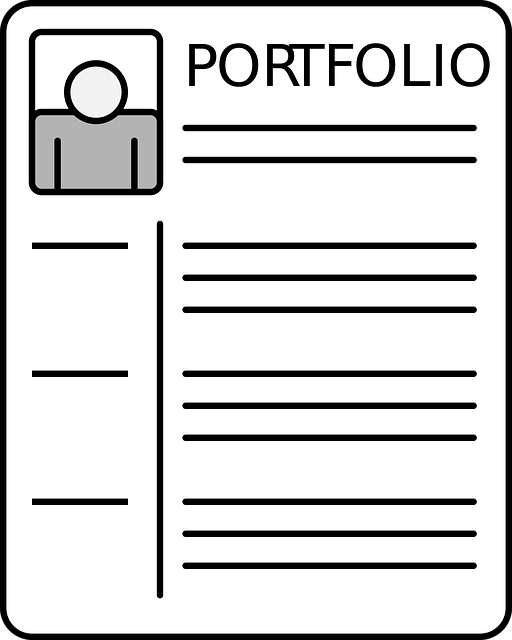

# Portfolio App
⭐ Star us on GitHub — it motivates us a lot!

This is a simple portfolio app designed to showcase my projects and skills.

`placeholder for screenshot`

| Project Name                                 | Web portfolio |
|----------------------------------------------|---------------|
| Project Start Date                           | 01-03-2024    |
| Status                                       | In Progress   |

## Table Of Content
- [Why](#why)
- [Features](#features)
  - [Must have](#must-have)
  - [Nice to have](#nice-to-have)
- [Quick Start](#quick-start)
  - [Running the Mock Web Application](#running-the-mock-web-application)
  - [More about Running the Web Application](#more-about-running-the-web-application)
- [Participation in the "100 Commits" Challenge](#participation-in-the-100-commits-challenge)
  - [Why This Project is Part of the "100 Commits" Challenge](#why-this-project-is-part-of-the-100-commits-challenge)
- [License](#license)
- [Links](#links)

## Why
I'm going to do few small projects, and portfolio is way to present my person, skills and job for investors.

## Features
### Must have
- [ ] Documentation
- [ ] About Me Page
  - [ ] Link to my CV
  - [ ] Short description of myself
  - [ ] Skills section
  - [ ] Contact section
- [ ] Projects page
- [ ] Application Top Bar
  - [ ] Links to my social media
  - [ ] Logo
  - [ ] Navigation buttons
- [ ] Support for 2 languages
  - [ ] Polish
  - [ ] English
### Nice to have
- [ ] Pages for Project Descriptions (one per project)
- [ ] Contact Form
  - [ ] Captcha Mechanism
- [ ] Google Analytics
- [ ] Recommendations Page
  - [ ] Book Tab
  - [ ] Courses Tab
  - [ ] Software Tab
  - [ ] Hardware Tab
- [ ] Backend
  - [ ] Send mail from contact form to my mail

## Quick start
### Running the Mock Web Application


1. Clone the web-portfolio repository:
```
git clone https://github.com/UgzSourceCode/web-portfolio.git
```
2. Navigate to the `web-app` folder:
```
cd web-portfolio
cd web-app
```
3. Install dependencies
```
npm i
```
4. Run the developer server with mocks:
```
npm run dev
```

### More about Running the Web Application
Instructions on setting up the React application can be found in [web-app/README.md](web-app/README.md)

## Participation in the "100 Commits" Challenge
This repository is participating in the ["100commitów"](https://100commitow.pl/) challenge. The challenge involves making at least one commit daily to an open-source project for 100 consecutive days.

The goal of the challenge is to encourage consistent contributions to open-source projects and to foster a habit of regular coding and collaboration within the developer community.

### Why This Project is Part of the "100 Commits" Challenge
My motivation for participating in this challenge includes:
- I have wanted to prepare a portfolio page for some time.
- This challenge has a community and Discord server where I can link my portfolio, which will be beneficial for the web app's SEO.
- Some of my friends from the Order Of Devs are also participating with their projects.
- I aim to make progress on it every day, step by step.

## License

This project is licensed under the Creative Commons Attribution 4.0 International License - see the [LICENSE](LICENSE) file for details.


## Links
- [Documentation](docs/README.md)
- [Issues](https://github.com/UgzSourceCode/web-portfolio/issues)

#### Picture sources
- [Portfolio logo - source](https://pixabay.com/pl/vectors/portfolio-cv-biznes-stanowisko-2903909/)
