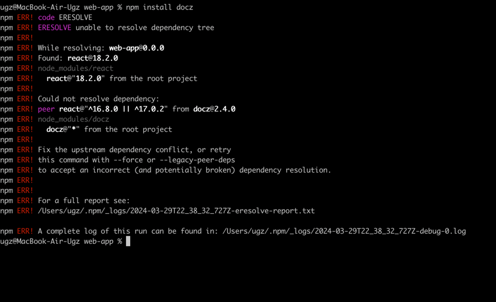

# [013] Stop using docz!
[< Back to ADR's list](README.md)

## Context and  Problem Statement
After conducting research, I've observed that the project appears to be inactive. The last release was in 2022, and we're now in 2024. Additionally, encountering the following error during installation further complicates matters:

## Considered Options
- Storybook
- Don't make component documentation

Option description was like in [012-is-component-documentation-a-good-idea.md](012-is-component-documentation-a-good-idea.md) but without docz.

## Suggestion
Still documentation have high priority.

## Decision Outcome
I will use storybook as popular and good supported tool.