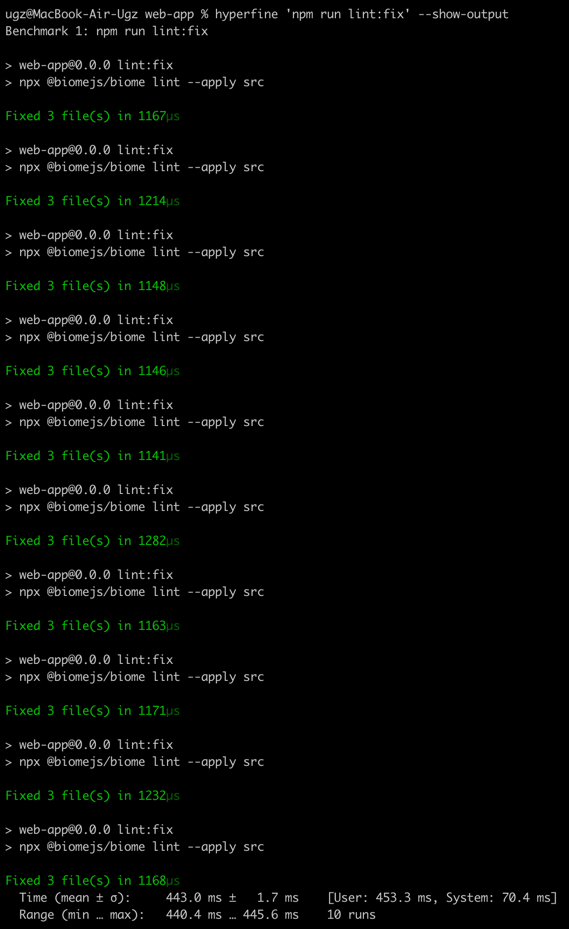

# BiomeJS as linter and formatter
[< Back to PoC's list](README.md)

## Link to ADR
`placeholder for link`

## Branch name
`PoC-biomejs-linter`

## Problem description
The project needs a linter and formatter for better code quality. A few libraries are new, so they need to be compared.

## What is testing?
Testing is done with BiomeJS. Biome is a fast formatter for JavaScript, TypeScript, JSX, and JSON.

Link to the project: https://biomejs.dev/

## What metrics will be used to compare solutions?
- Formatting time: the time from start to finish of the formatting process.
- Lint fixing time: the time from start to finish of fixing linting issues.
- Lint checking time: the time from start to finish of the linting process.
- Integration with IDE: existing plugin/extension.

Time in terminal will be measured using `hyperfine`  on mac os. 

## Expectations
`BiomeJS` is tool based on Rust stack, so I expect that this tool will be faster than eslint.

## Results for this PoC
- Formatting time

Average user time: 440.0 ms
Minimum user time: 438.4 ms
Maximum user time: 441.4 ms

- Lint fixing time

Average user time: 447.9 ms
Minimum user time: 439.5 ms
Maximum user time: 504.6 ms

- Lint checking time

Average user time: 443.3 ms
Minimum user time: 439.8 ms
Maximum user time: 452.1 ms

- Integrations with IDEs
Biome has plugins for a few IDEs. However, for the development of this project, I use WebStorm, which doesn't have a plugin.

## Observations
1. Biome has a lot more default enabled rules than ESLint. For example:
- `lint/style/noNonNullAssertion`

- `noBlankTarget`

- `lint/a11y/useButtonType`

2. Biome includes a code formatter internally, without requiring additional packages.
3. Based on Biome's GitHub issues, I guess that it's not a good option for commercial projects that require stable tools. However, for a small project like this, it can be a great option. And I believe that this tool will be better in the future.