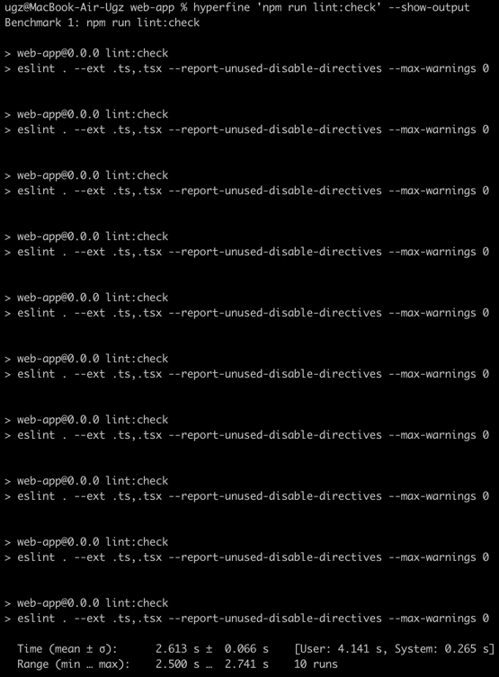

# Eslint ad linter and Prettier as formatter 
[< Back to PoC's list](README.md)

## Link to ADR
[005-which-linter-and-formatter-will-be-better.md](../ADR/005-which-linter-and-formatter-will-be-better.md)

## Branch name
`PoC-eslint-linter`

## Problem description
The project needs a linter and formatter for better code quality. A few libraries are new, so they need to be compared.

## What is testing?
Testing is done with Eslint and Prettier.
Eslint is a popular tool for linting JavaScript and TypeScript code.
Prettier is a popular tool for formatting JavaScript and TypeScript code.

Link to Eslint: https://eslint.org/
Link to Prettier: https://prettier.io/

## What metrics will be used to compare solutions?
- Formatting time: the time from start to finish of the formatting process.
- Lint fixing time: the time from start to finish of fixing linting issues.
- Lint checking time: the time from start to finish of the linting process.
- Integration with IDE: existing plugin/extension.

Time in terminal will be measured using `hyperfine`  on mac os.

## Expectations
Eslint and Prettier are popular tools for JS stack. So I expect that this have a lot tutorials, knowledge, IDE plugins and work out of the box with vite react-ts template.

## Results for this PoC
- Formatting time

For this command output was hidden. Because with list of files output is so long.

Average user time: 513.3 ms
Minimum user time: 511.5 ms
Maximum user time: 520.8 ms

Example output for prettier:

- Lint fixing time

Average user time: 2,588 s
Minimum user time: 2,482 s
Maximum user time: 2,672 s

- Lint checking time

Average user time: 2,613 s
Minimum user time: 2,500 s
Maximum user time: 2,741 s

- Integrations with IDEs
Eslint and Prettier has plugins for all IDE which I know.

## Observations
[description]