# UX research
[< Back to Documentation README](README.md)

This document will describe the portfolio websites, designs, or templates that I found, along with my thoughts on them, supplemented by additional information from other people.

## Table Of Content
1. [Research plan](#research-plan)
2. [Research scenarios](#research-scenarios)
3. [Found Designs](#found-designs)
4. [Found Other Portfolios](#found-another-portfolios)
5. [Found Templates](#found-templates)
6. [Questionnaire Results](#questionnaire-result)
7. [What I want](#what-i-want)

## Research plan
1. **Defining Objectives**: Initially, it's crucial to clearly define the research objectives. Are you aiming to understand user behaviors, identify issues in the user interface, or test a new project? It's essential to determine what you aim to achieve. For this research, aiming is understand what is important for user and how should show it.
2. **Choosing the appropriate research methodology**: There are many different research methods, such as competitive analysis, user observations, interviews, usability testing, customer journey mapping, etc. For this research, competitive analysis has been chosen.
3. **Creating Research Scenarios**: Prepare a set of scenarios or questions that will assist you in conducting research. Ensure that they are tailored to the chosen research methodology and will help in obtaining answers to the posed questions. For this research, scenarios you should find in [research scenarios](#research-scenarios) part.
4. **Recruitment of Participants**: Select the appropriate target group for the research. Participant recruitment can be conducted through various channels, depending on the nature of the study and the target audience.
5. **Conducting Research**: Carry out the planned research using the selected methods. Remember to maintain neutrality and avoid influencing respondents' answers.
6. **Analysis of Collected Data**: After completing the research, proceed to analyze the collected data. Depending on the research method, this may involve reviewing notes, transcribing interviews, analyzing usability test results, etc.
7. **Inference and Drawing Conclusions**: Based on the collected data, draw conclusions and identify key areas for improvement or development. Try to rely on specific data rather than just intuition.
8. **Implementation**: Based on the findings from the research, take specific design-related actions to improve the user experience. This may involve changes to the user interface, enhancements to customer service processes, etc.
8. **Testing Solutions**: After implementation, conduct tests to verify their effectiveness and understandability to users.
9. **Iterative Cycle**: The UX research and design process should be iterative. After completing one iteration, analyze the results, draw conclusions, and move on to the next iteration to continuously improve the product.

## Research scenarios
1. Prepare few questions:
   - Does the design capture attention and encourage interaction? (What graphical elements are the most attractive?)
   - Are users able to easily find information? (How do you rate the readability of the content?; Is the navigation intuitive?)
   - Is the design responsive and functioning correctly on various devices? (What are the user experiences on different devices?; Are interactions smooth and seamless on smartphones, tablets, and computers?)
   - Are there areas that users find difficult or unintuitive?
   - Is the design compliant with the latest trends and industry standards? (Does it meet current UX/UI standards?; Does it incorporate innovative solutions in line with current trends?)
   - Are users easily situated within the project context? (What are users' first impressions upon entering the website or opening the portfolio?; Do they immediately understand what you do and what you offer?)
   - Are there any elements that deter users or cause confusion? (Are there any elements that may deter users?; Are there elements that are not consistent with the rest of the design?)
2. Ask few friend about designs
3. Ask people from social media
4. Find and ask 

## Found designs
### SinanTokmak Web Developer Portfolio Website Template
Author: [Johan Leon](https://linktr.ee/johannleon)

Link: [Figma community](https://www.figma.com/community/file/1308624569713896610)

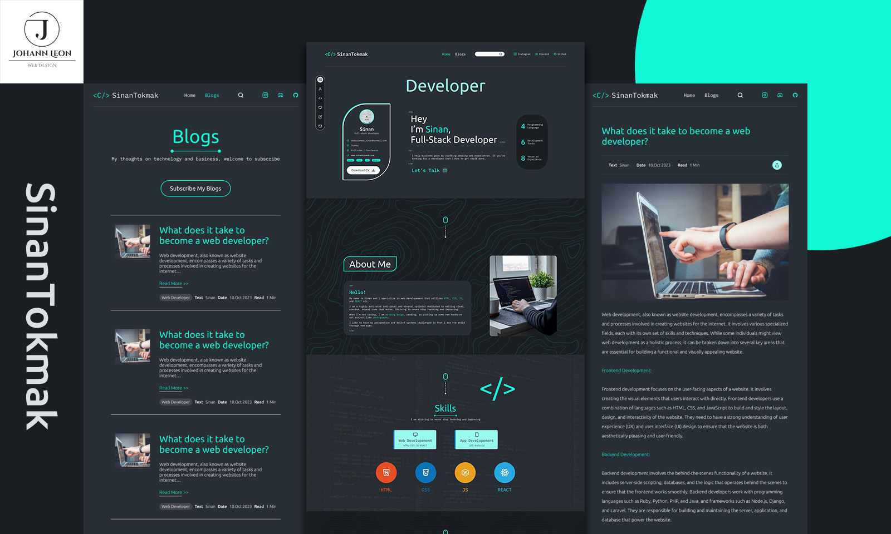

#### My answers
- Does the design capture attention and encourage interaction? (What graphical elements are the most attractive?)

This design certainly grabs attention, but it doesn't encourage interaction. What appeals to me is the way it divides the view into smaller modules, as well as how it adjusts the font size and color of the text to match the background.

- Are users able to easily find information? (How do you rate the readability of the content?; Is the navigation intuitive?)

The information is neatly organized in predictable places. However, some buttons are illegible or deviate from the convention.

- Is the design responsive and functioning correctly on various devices? (What are the user experiences on different devices?; Are interactions smooth and seamless on smartphones, tablets, and computers?)

Yes, the design is intended for smartphones, tablets, laptops, and desktops. One element worth checking might be the contact form for mobile devices.

- Are there areas that users find difficult or unintuitive?

The 'Let's talk' button looks different from the other buttons.
Some `
` and `<h1>` are on one page only.

- Is the design compliant with the latest trends and industry standards? (Does it meet current UX/UI standards?; Does it incorporate innovative solutions in line with current trends?)

The design is more classic than innovative, which will keep it relevant for longer.

- Are users easily situated within the project context? (What are users' first impressions upon entering the website or opening the portfolio?; Do they immediately understand what you do and what you offer?)

On the website, it's immediately clear what the owner's focus is, but it's unclear what services are offered and what types of collaboration are available.

- Are there any elements that deter users or cause confusion? (Are there any elements that may deter users?; Are there elements that are not consistent with the rest of the design?)

Yes, this design has several defects. These include inconsistencies in button colors, as well as inconsistencies in the form of buttons and the use of `
` and `<h1>` tags.

#### Defects:
- Interactive elements (buttons) should have aquamarine color, as well as highlighted elements that are not clickable.
- Active menu items in the header and in the left menu should have an aquamarine color. In the left menu, when an item is inactive, the color should be white.
- All elements should have equal, rounded corners, except for the "about me" text, which resembles a button, and the "send me a message" element.
- Color consistency was broken when it came to displaying technologies (4 additional colors were introduced, expanding the palette from 6 to 10 items).
- The search bar on the black page burns my eyes with its whiteness.
- Margins are too large and can disrupt the consistency of the page's appearance.
- Sometimes there are `<h1>` and `
` tags next to some elements on the homepage, but the author quickly forgets about them in subsequent views.
- It is recommended to check the contact form on a mobile device for readability and usability.

#### Feedback from
1. First person:
   - The "Let's talk" button may be confusing for typical users who may not recognize it as a button.
   - The icons at the bottom of the page, especially the red, blue, and orange ones, are too prominent and overshadow the rest of the colors on the page.
   - The "App Development" and "Web Development" panels should be larger, and the code icon should be symmetrically placed to be more visible.
   - The main goal of the portfolio page is to showcase skills, so they should be clearly visible and easily recognizable.
2. Second person:
   - Cool, modern. I like the combination of gray with green. Really nice design.

### Personal Portfolio Website
Author: [Dliya' Zarror Nibros](https://www.figma.com/@dzarrorn)

Link: [Figma Community](https://www.figma.com/community/file/1046782956165823626)

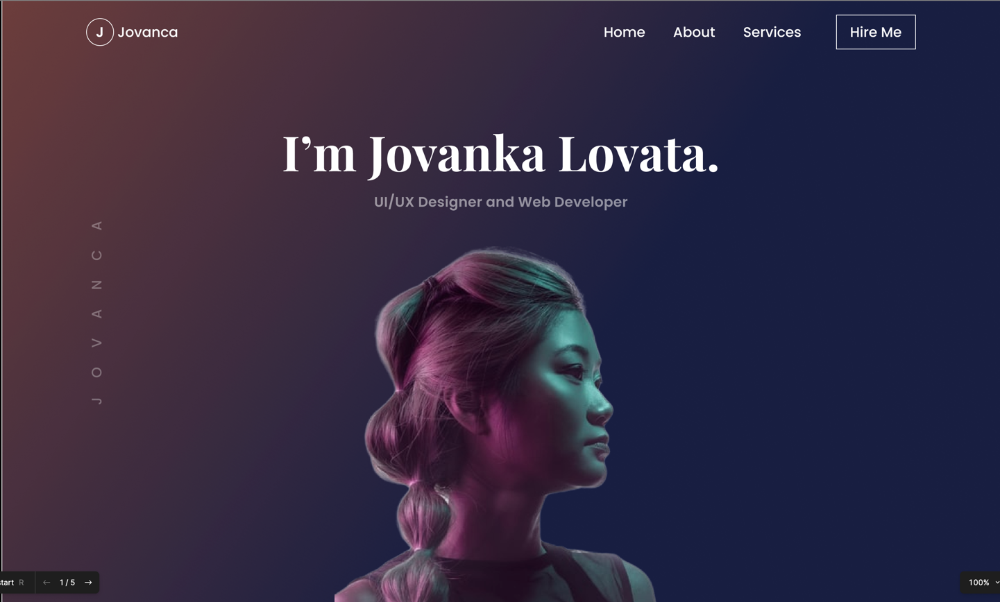

#### My answers
- Does the design capture attention and encourage interaction? (What graphical elements are the most attractive?)

Yes, it moderately captures attention but encourages interaction. I can't pinpoint one specific graphical element that stands out the most, but I appreciate the cleanliness and simplicity of this design.

- Are users able to easily find information? (How do you rate the readability of the content?; Is the navigation intuitive?)

Yes, finding information isn't difficult. However, mainly because there isn't much of it, and some may be missing.

- Is the design responsive and functioning correctly on various devices? (What are the user experiences on different devices?; Are interactions smooth and seamless on smartphones, tablets, and computers?)

This design is prepared in a single variant, which may not look optimal on mobile devices depending on the implementation.

- Are there areas that users find difficult or unintuitive?

As a user, I'm not entirely sure what the logo on the black bar represents.

- Is the design compliant with the latest trends and industry standards? (Does it meet current UX/UI standards?; Does it incorporate innovative solutions in line with current trends?)

It lacks innovation, and gradient purple backgrounds are almost out of fashion, if not completely outdated.

- Are users easily situated within the project context? (What are users' first impressions upon entering the website or opening the portfolio?; Do they immediately understand what you do and what you offer?)

Yes, although the initial view doesn't immediately convey much.

- Are there any elements that deter users or cause confusion? (Are there any elements that may deter users?; Are there elements that are not consistent with the rest of the design?)

There's nothing particularly alarming about this design.

#### Feedback from
2. Second person
   - This type of websites repel me. Usually when I come across such sites, I know I will probably have to search for some options. Looks okay, but poorly designed navigation gives me negative associations.

### Portfolio - Figma Template
Author: [KingKatz aka midjourney2figma](https://www.instagram.com/midjourney2figma)

Link: [Figma Community](https://www.figma.com/community/file/1201747719279089009)

Repo demo: [Github](https://github.com/nerkat/portfolio)

Live demo: [FireBase Web App](https://ai-ui-c0f48.web.app/)

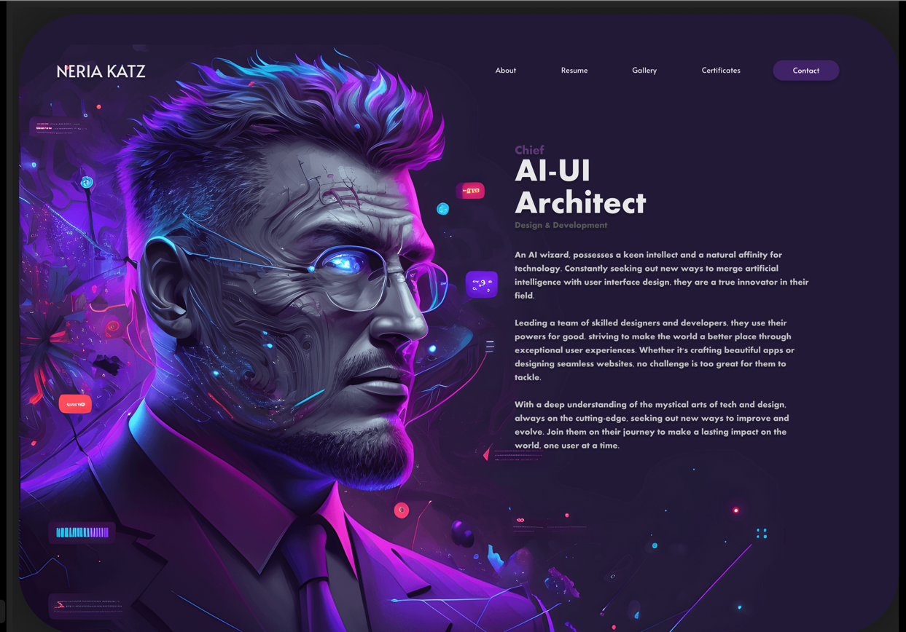

#### My answers
- Does the design capture attention and encourage interaction? (What graphical elements are the most attractive?)

The design certainly grabs attention, but it doesn't encourage interaction. At the moment, what's most attractive to me is the background, but I know that AI is a novelty, and in some time, it won't be as appealing.

- Are users able to easily find information? (How do you rate the readability of the content?; Is the navigation intuitive?)

Yes, the navigation is intuitive, and the information is where I expect it to be.

- Is the design responsive and functioning correctly on various devices? (What are the user experiences on different devices?; Are interactions smooth and seamless on smartphones, tablets, and computers?)

No, the design was only intended for the desktop version.

- Are there areas that users find difficult or unintuitive?

The fonts and elements are quite small, making them poorly legible.

- Is the design compliant with the latest trends and industry standards? (Does it meet current UX/UI standards?; Does it incorporate innovative solutions in line with current trends?)

Yes, the design looks very modern, thanks to AI.

- Are users easily situated within the project context? (What are users' first impressions upon entering the website or opening the portfolio?; Do they immediately understand what you do and what you offer?)

Yeah, overall, the initial description is quite lengthy. It could be broken down into some icons and labels or highlight more clearly what information will be offered and in what form.

- Are there any elements that deter users or cause confusion? (Are there any elements that may deter users?; Are there elements that are not consistent with the rest of the design?)

In the background, there are artifacts resembling, for example, blurred texts, and additionally, most of the attention is stolen by the background.

#### Feedback from
1. First person:
   - Below the white title, the subtitle text is too small and difficult to notice.
   - The colors of the titles could be better adjusted to contrast with the background and be more visible.
   - The long text may not be readable for most users, leading to a loss of interest.
   - The lack of a clear message about what the website offers or sells may cause users to misunderstand its value.
2. Second person:
   - This type of websites repel me. Usually when I come across such sites, I know I will probably have to search for some options. Looks okay, but poorly designed navigation gives me negative associations.

### PORTFOLIO DESIGN KIT
Author: [Tolulope Adeyemo](https://www.figma.com/@adeyemotolulope)

Link: [Figma Community](https://www.figma.com/community/file/1095297962086392253)

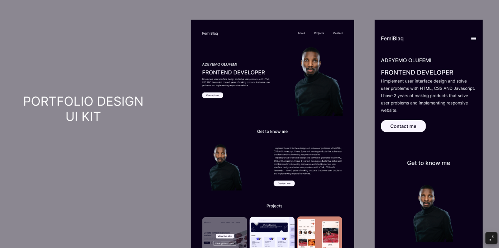

#### My answers
- Does the design capture attention and encourage interaction? (What graphical elements are the most attractive?)

The design moderately captures attention and encourages interaction. The most appealing element seems to be the project presentations.

- Are users able to easily find information? (How do you rate the readability of the content?; Is the navigation intuitive?)

There isn't too much information, and intuitively, it seems to be where I expect it to be.

- Is the design responsive and functioning correctly on various devices? (What are the user experiences on different devices?; Are interactions smooth and seamless on smartphones, tablets, and computers?)

Yes, the design is prepared for both desktop and mobile devices. However, on mobile devices, there is significantly more compression.

- Are there areas that users find difficult or unintuitive?

I don't see any areas that would make it difficult for me to understand the content.

- Is the design compliant with the latest trends and industry standards? (Does it meet current UX/UI standards?; Does it incorporate innovative solutions in line with current trends?)

The design is more classical than modern, which will keep it relevant for longer.

- Are users easily situated within the project context? (What are users' first impressions upon entering the website or opening the portfolio?; Do they immediately understand what you do and what you offer?)

Finding one's way around is quite easy, but the offerings are not particularly well highlighted.

- Are there any elements that deter users or cause confusion? (Are there any elements that may deter users?; Are there elements that are not consistent with the rest of the design?)

Contacting via providing an email address that looks somewhat daunting, plus the text compression for mobile devices doesn't look too good either.

#### Feedback from:
2. Second person:
   - This type of websites repel me. Usually when I come across such sites, I know I will probably have to search for some options. Looks okay, but poorly designed navigation gives me negative associations.

### Personal Portfolio Website
Author: [Dliya' Zarror Nibros](https://www.figma.com/@dzarrorn)

Link: [Figma Community](https://www.figma.com/community/file/1046281425042561033)

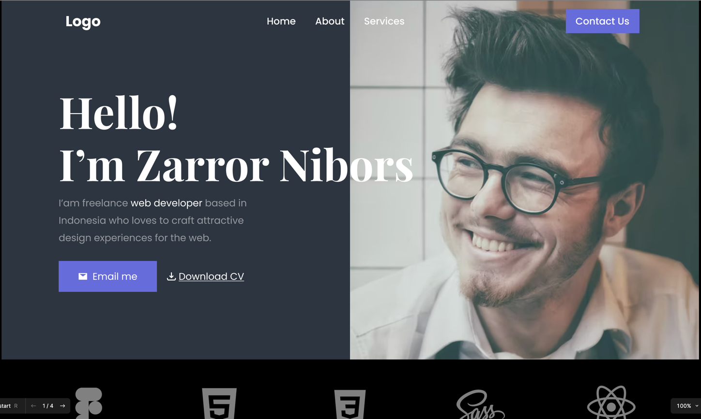

#### My answers
- Does the design capture attention and encourage interaction? (What graphical elements are the most attractive?)

The design captures attention to a moderate extent, but it fares a bit better in encouraging interaction.

- Are users able to easily find information? (How do you rate the readability of the content?; Is the navigation intuitive?)

The information on the website is quite easy to find, but in my opinion, it's insufficient. It should be expanded to include more technical aspects.

- Is the design responsive and functioning correctly on various devices? (What are the user experiences on different devices?; Are interactions smooth and seamless on smartphones, tablets, and computers?)

No, the design is intended only for desktop. Browsing it on mobile devices, in my opinion, won't be very convenient.

- Are there areas that users find difficult or unintuitive?

Knowing the logo of the technology, one can assume that the black bar represents the technological stack in which the company operates. However, for those not interested in technical aspects, there is a risk that this information may not be very meaningful to them.

- Is the design compliant with the latest trends and industry standards? (Does it meet current UX/UI standards?; Does it incorporate innovative solutions in line with current trends?)

The design doesn't look very modern or indicative of current trends. However, it is neat and should remain relevant for a longer period.

- Are users easily situated within the project context? (What are users' first impressions upon entering the website or opening the portfolio?; Do they immediately understand what you do and what you offer?)

Yes, finding information about the project context is straightforward and intuitive. From the beginning, it's clear what the owner of the website is involved in.

- Are there any elements that deter users or cause confusion? (Are there any elements that may deter users?; Are there elements that are not consistent with the rest of the design?)

I don't see any elements that could deter or confuse.

### Conclusion from all designs
Better way is use some classic design for this portfolio, because I don't have plan update and change it often after finish.

## Found another portfolios

### Frontend web developer portfolio
Link: [Norbert Zegan](https://www.norbertzegan.com/)

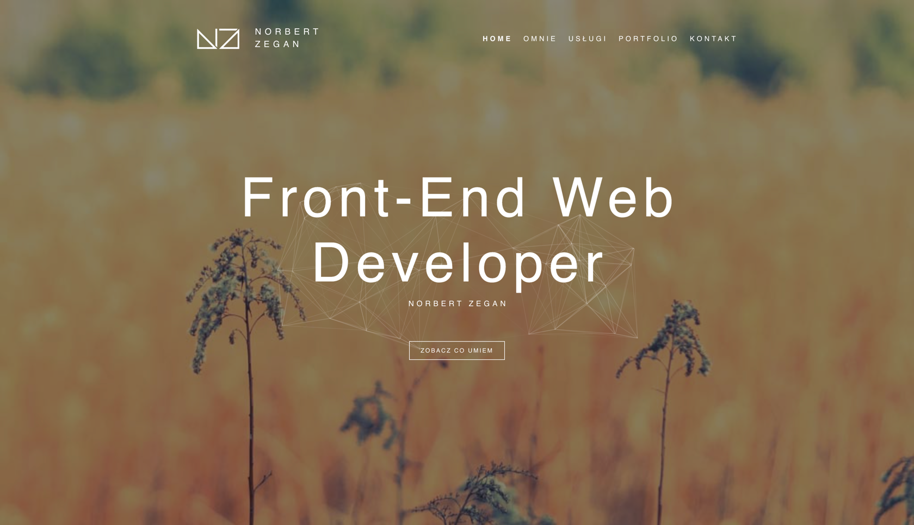

#### My answers
- Does the design capture attention and encourage interaction? (What graphical elements are the most attractive?)

Yes, the design captures attention. It's simple and aesthetic, I like that there aren't too many elements when browsing.

- Are users able to easily find information? (How do you rate the readability of the content?; Is the navigation intuitive?)

In most cases, finding information is easy, but I have mixed feelings about the blocks that need to be hovered over to see the description. Theoretically, most people should notice them, and they are not critical information - but it's worth considering.

- Is the design responsive and functioning correctly on various devices? (What are the user experiences on different devices?; Are interactions smooth and seamless on smartphones, tablets, and computers?)

Yes, the design is prepared for both desktop and mobile devices. However, I don't like that at a narrower screen width, the menu is located very close to the logo.

- Are there areas that users find difficult or unintuitive?

Other than the elements I mentioned, such as those expanding on mouse hover, I have no objections.

- Is the design compliant with the latest trends and industry standards? (Does it meet current UX/UI standards?; Does it incorporate innovative solutions in line with current trends?)

The design is more classic, with the only standout feature being the background with an animated element.

- Are users easily situated within the project context? (What are users' first impressions upon entering the website or opening the portfolio?; Do they immediately understand what you do and what you offer?)

Yes.

- Are there any elements that deter users or cause confusion? (Are there any elements that may deter users?; Are there elements that are not consistent with the rest of the design?)

No.

#### Feedback from
1. First person:
   - Changing the text "Zobacz co umiem" to "Zobacz moje umiejętności" would be more appropriate.
   - There is a typo in the menu word "OMNIE", it should be written as "O MNIE" or "O mnie".
   - Instead of "Home", it would be better to use "Strona Główna" to avoid mixing two languages.
2. Second person:
   - Nice, really nice. And that's all I can say because, after all, it doesn't stand out in any way.

### Frontend developer portfolio
Link: [Janus Marcin](https://www.janusmarcin.pl/)

#### My answers
- Does the design capture attention and encourage interaction? (What graphical elements are the most attractive?)

Yes, although the background elements distract from the content. The button encourages interaction by prompting for contact. Unfortunately, the surrounding information does not provide clarity on the purpose and types of offers the owner is open to.

- Are users able to easily find information? (How do you rate the readability of the content?; Is the navigation intuitive?)

Most of the information is easy to find. However, one needs to guess what types of collaboration interest the owner of the website.

- Is the design responsive and functioning correctly on various devices? (What are the user experiences on different devices?; Are interactions smooth and seamless on smartphones, tablets, and computers?)

Yes, the design is optimized for various devices. In most cases, readability doesn't deteriorate, but during tablet simulations, the fonts appeared too small.

- Are there areas that users find difficult or unintuitive?

The background and the cursor-following dot are highly distracting.

- Is the design compliant with the latest trends and industry standards? (Does it meet current UX/UI standards?; Does it incorporate innovative solutions in line with current trends?)

No, the fonts sometimes appear clunky, and the background tends to grab attention unnecessarily

- Are users easily situated within the project context? (What are users' first impressions upon entering the website or opening the portfolio?; Do they immediately understand what you do and what you offer?)

Yes, from the very beginning, this page looks like a business card.

- Are there any elements that deter users or cause confusion? (Are there any elements that may deter users?; Are there elements that are not consistent with the rest of the design?)

Yes, the background and the cursor-following dot I mentioned in previous points.

#### Feedback from:
2. Second person:
   - The sphere is a bit distracting. The design is mediocre, I would dismiss it immediately.

### Product Designer portfolio
Link: [Sean Halpin](https://www.seanhalpin.xyz/)

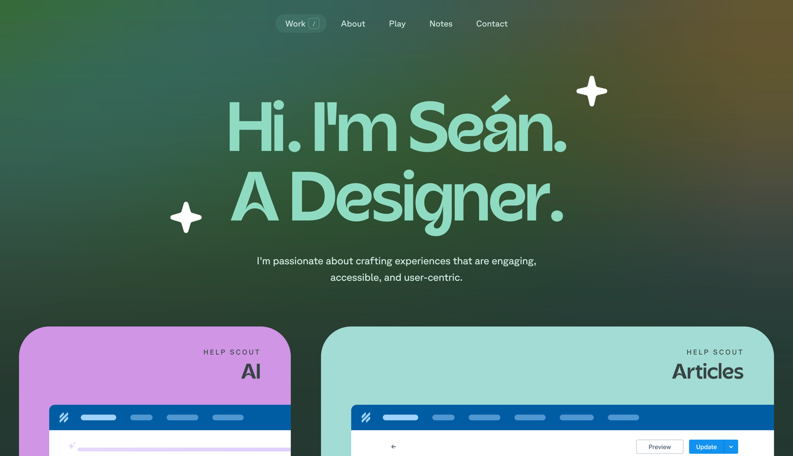

#### My answers
- Does the design capture attention and encourage interaction? (What graphical elements are the most attractive?)

The design is aesthetic and attention-grabbing. However, I did not find any element that encourages interaction.

- Are users able to easily find information? (How do you rate the readability of the content?; Is the navigation intuitive?)

Most things seem clear, but I am missing information about what the site owner is looking for(What types of collaborations is he open to?).

- Is the design responsive and functioning correctly on various devices? (What are the user experiences on different devices?; Are interactions smooth and seamless on smartphones, tablets, and computers?)

Yes, the design is responsive and scales well on desktop, tablet, and smartphone.

- Are there areas that users find difficult or unintuitive?

I am not a fan of communication bots; some options could also be available without the bot, such as a form or just an email address.

- Is the design compliant with the latest trends and industry standards? (Does it meet current UX/UI standards?; Does it incorporate innovative solutions in line with current trends?)

Yes.

- Are users easily situated within the project context? (What are users' first impressions upon entering the website or opening the portfolio?; Do they immediately understand what you do and what you offer?)

From the beginning, I have a sense of aesthetics, good color selection, and a combination of classic and modern looks.

- Are there any elements that deter users or cause confusion? (Are there any elements that may deter users?; Are there elements that are not consistent with the rest of the design?)

No.

#### Feedback from
1. First person:
   - Intense contrast of the pink color stands out and doesn't fit well.
2. Second person:
   - It doesn't look very professional.

### Digital Designer & frontend developer portfolio
Link: [Marc Thomas](http://mrcthms.com/)

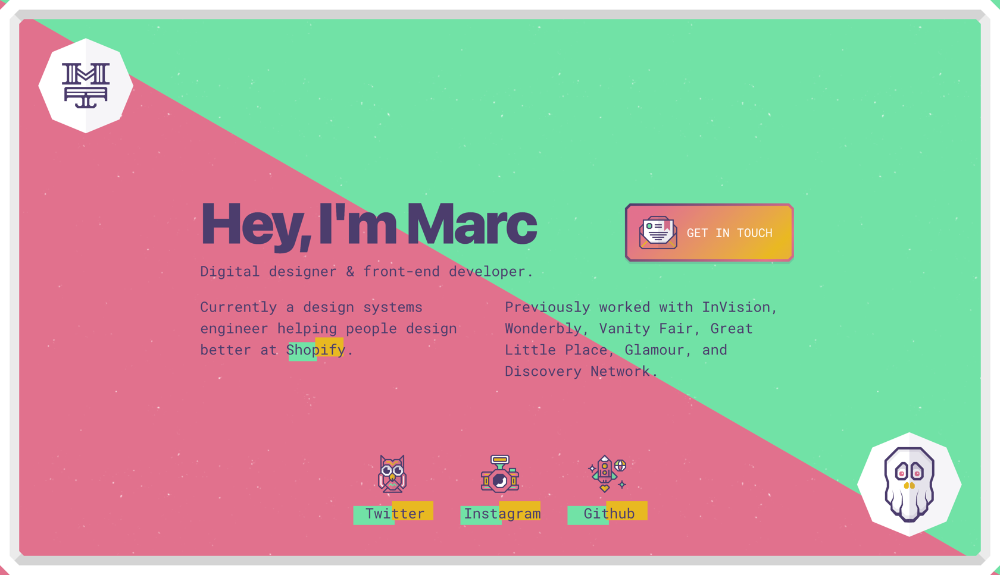

#### My answers
- Does the design capture attention and encourage interaction? (What graphical elements are the most attractive?)

It catches the eye, but only for a moment. I did not feel inclined to interact after viewing this site.

- Are users able to easily find information? (How do you rate the readability of the content?; Is the navigation intuitive?)

Yes, and the site is so simple that it doesn't require navigation.

- Is the design responsive and functioning correctly on various devices? (What are the user experiences on different devices?; Are interactions smooth and seamless on smartphones, tablets, and computers?)

The site scales well and maintains readability on desktop, tablet, and smartphone versions.

- Are there areas that users find difficult or unintuitive?

Reading text that is placed over background intersections is a frustrating aesthetic experience for me.

- Is the design compliant with the latest trends and industry standards? (Does it meet current UX/UI standards?; Does it incorporate innovative solutions in line with current trends?)

It's hard for me to determine with this design. I wouldn't call it either trendy or classic.

- Are users easily situated within the project context? (What are users' first impressions upon entering the website or opening the portfolio?; Do they immediately understand what you do and what you offer?)

Yes, the context is clear and strongly resembles a simple business card.

- Are there any elements that deter users or cause confusion? (Are there any elements that may deter users?; Are there elements that are not consistent with the rest of the design?)

Other than the previously mentioned text on color intersections, I don't see any more confusing elements.

#### Feedback from
1. First person:
   - The text is hard to read; I would suggest changing the color or modifying the colors of the triangles to improve readability.
2. Second person:
   - At first, I didn't notice the GitHub button. It's too colorful, and the elements blend into the background.

### Senior frontend developer
Link: [Brittany Chiang](https://brittanychiang.com/)

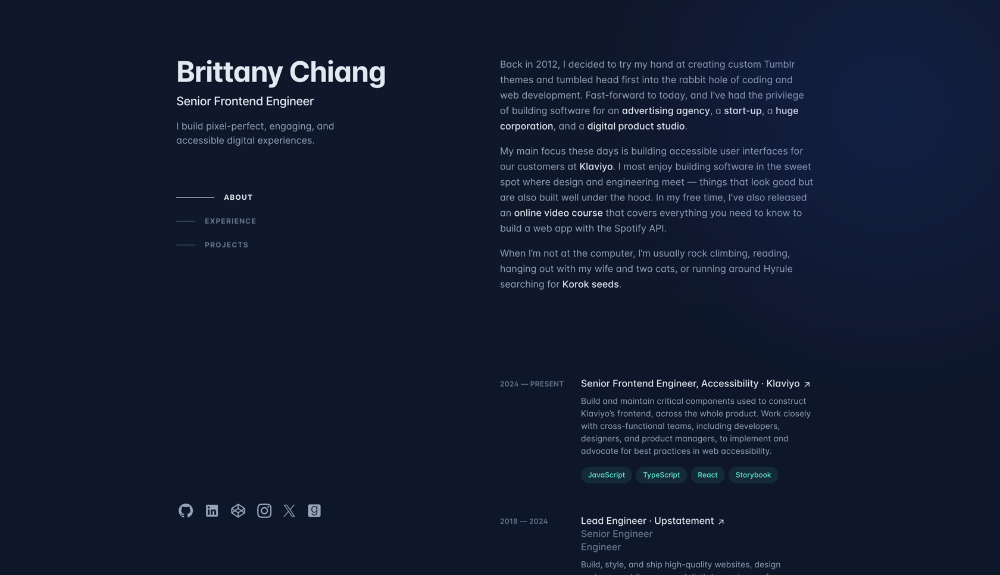

#### My answers
- Does the design capture attention and encourage interaction? (What graphical elements are the most attractive?)

Yes, the design captures attention with its simplicity and clarity. However, I don't see any elements encouraging me to interact.

- Are users able to easily find information? (How do you rate the readability of the content?; Is the navigation intuitive?)

Yes, all the information is readable and located in intuitive places for me.

- Is the design responsive and functioning correctly on various devices? (What are the user experiences on different devices?; Are interactions smooth and seamless on smartphones, tablets, and computers?)

Yes, the design is responsive and works well on both desktop, tablet, and smartphone. However, when testing it on an iPad Pro, the fonts seem too small.

- Are there areas that users find difficult or unintuitive?

I don't see any problematic areas in this case.

- Is the design compliant with the latest trends and industry standards? (Does it meet current UX/UI standards?; Does it incorporate innovative solutions in line with current trends?)

The design is more classic and simple than modern.

- Are users easily situated within the project context? (What are users' first impressions upon entering the website or opening the portfolio?; Do they immediately understand what you do and what you offer?)

Yes.

- Are there any elements that deter users or cause confusion? (Are there any elements that may deter users?; Are there elements that are not consistent with the rest of the design?)

I didn't find any deterrent elements.

#### Feedback from
1. First person
   - I would try to move the dates more to the left to fill up this side.
   - Some experimentation is needed because the right side is occupied by a lot of content, while the left side appears too empty.
2. Second person:
   - I like this one except for the color choice. If the colors were different, it would be the best at the moment. Right now, it's number two. It's clear, readable, modern, and SIMPLE (because I value simplicity).

### Some web developers group
Link: [Animal](https://animalmade.com/)

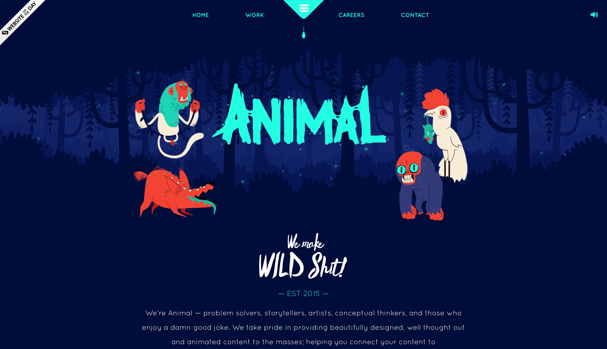

#### My answers
- Does the design capture attention and encourage interaction? (What graphical elements are the most attractive?)

This website definitely captures attention, it has a lot of interesting animations and is controversial.

- Are users able to easily find information? (How do you rate the readability of the content?; Is the navigation intuitive?)

Roughly yes, although the 'Careers' tab could contain clearer information, similarly, the 'Contact' section simply redirects to links at the bottom of the page.

- Is the design responsive and functioning correctly on various devices? (What are the user experiences on different devices?; Are interactions smooth and seamless on smartphones, tablets, and computers?)

Yes, the website functions correctly on both desktop, tablet, and smartphone.

- Are there areas that users find difficult or unintuitive?

I didn't find anything that could cause me a problem. Although I'm afraid that:
- an animation of a rat eating a keyboard instead of text saying there are no offers in the careers section would be clearer,
- a form would be more pleasant in reception than showing and emphasizing links at the bottom of the page.

- Is the design compliant with the latest trends and industry standards? (Does it meet current UX/UI standards?; Does it incorporate innovative solutions in line with current trends?)

It's not a design that fits the latest trends, but in my opinion, it still looks fresh and eye-catching.

- Are users easily situated within the project context? (What are users' first impressions upon entering the website or opening the portfolio?; Do they immediately understand what you do and what you offer?)

Yes.

- Are there any elements that deter users or cause confusion? (Are there any elements that may deter users?; Are there elements that are not consistent with the rest of the design?)

No, although the whole thing may be perceived as unserious.

#### Feedback from
1. First person:
   - This one is nice.
2. Second person:
   - It looks unprofessional, and from the graphics, I have no idea what to expect from this site.

### Conclusion from all other portfolios

Many portfolio websites do not specify the form of collaboration their owners are interested in.

## Found templates

### Whosbl33h by Sara Echeverría
Link to demo: [Netlify](https://whosbl33h.netlify.app/)

Link to template: [GitHub](https://github.com/bl33h/whosbl33h)

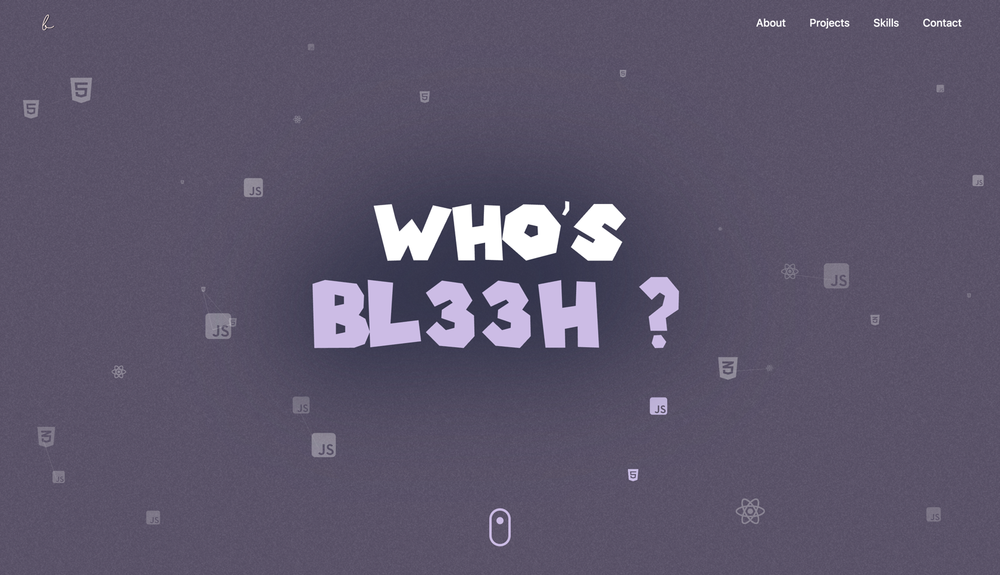

#### My answers
- Does the design capture attention and encourage interaction? (What graphical elements are the most attractive?)

In my opinion, this design is attractive and catches the eye. The most appealing elements are the colors and typography. However, I don't see any features that encourage interaction.

- Are users able to easily find information? (How do you rate the readability of the content?; Is the navigation intuitive?)

Navigation is intuitive, but reading the skills is tiring for me. I would prefer a static page instead of scrolling elements.

- Is the design responsive and functioning correctly on various devices? (What are the user experiences on different devices?; Are interactions smooth and seamless on smartphones, tablets, and computers?)

Yes, the design is responsive, although I have noticed that when reducing the browser window width, some elements overlap.

- Are there areas that users find difficult or unintuitive?

No, I don't see such areas, except for the difficulty in reading the skills, which I mentioned earlier.

- Is the design compliant with the latest trends and industry standards? (Does it meet current UX/UI standards?; Does it incorporate innovative solutions in line with current trends?)

Yes, the design is more modern than classic. However, it does not include innovative elements.

- Are users easily situated within the project context? (What are users' first impressions upon entering the website or opening the portfolio?; Do they immediately understand what you do and what you offer?)

Understanding the purpose of the site only comes after scrolling and getting acquainted with the content, although the menu in the upper right corner does provide some hints.

- Are there any elements that deter users or cause confusion? (Are there any elements that may deter users?; Are there elements that are not consistent with the rest of the design?)

No.

### Slick Portfolio Svelte by Riadh Adrani
Link to demo: [GitHub Pages](https://riadhadrani.github.io/slick-portfolio-svelte)

Link to template: [GitHub](https://github.com/RiadhAdrani/slick-portfolio-svelte)

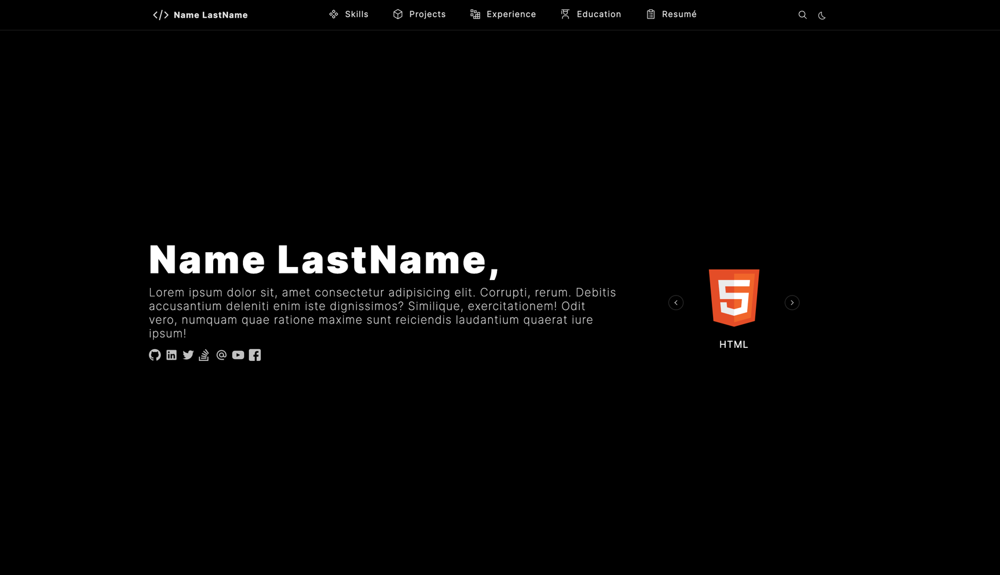

#### My answers
- Does the design capture attention and encourage interaction? (What graphical elements are the most attractive?)

The website is rather simple, not eye-catching and doesn't attract attention.

- Are users able to easily find information? (How do you rate the readability of the content?; Is the navigation intuitive?)

Yes, the website starts with a description of the person that could contain everything. Although, in the template used, there is the text "Lorem ipsum".

- Is the design responsive and functioning correctly on various devices? (What are the user experiences on different devices?; Are interactions smooth and seamless on smartphones, tablets, and computers?)

Yes, the website works on both desktop, tablet, and smartphone, while maintaining consistency in its simplicity.

- Are there areas that users find difficult or unintuitive?

I don't see any problematic areas. Everything is exactly where I expect it to be.

- Is the design compliant with the latest trends and industry standards? (Does it meet current UX/UI standards?; Does it incorporate innovative solutions in line with current trends?)

No, the design leans more towards simple and classic.

- Are users easily situated within the project context? (What are users' first impressions upon entering the website or opening the portfolio?; Do they immediately understand what you do and what you offer?)

Yes, it's easy to find yourself in the context of the project right from the start. The user can immediately understand what the owner of the website does, although the website gives the impression of being old.

- Are there any elements that deter users or cause confusion? (Are there any elements that may deter users?; Are there elements that are not consistent with the rest of the design?)

No.

### Astro Boilerplate by Remi Wg
Link to demo: [Creative Designs Guru](https://creativedesignsguru.com/demo/astro-boilerplate/)

Link to template: [GitHub](https://github.com/ixartz/Astro-boilerplate)

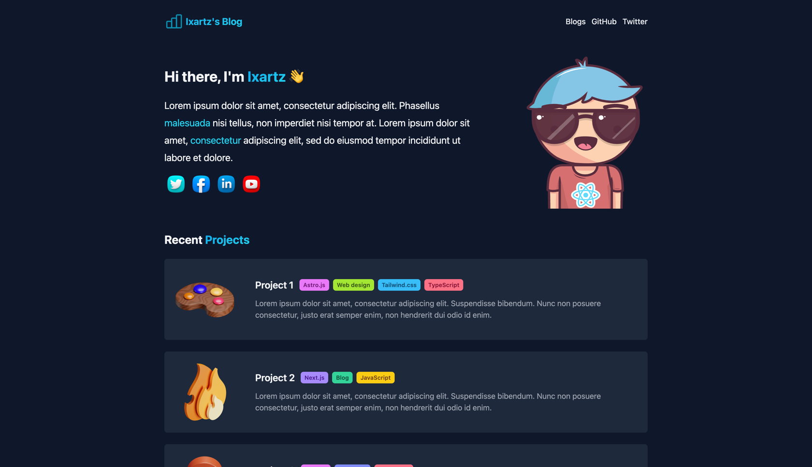

#### My answers
- Does the design capture attention and encourage interaction? (What graphical elements are the most attractive?)

In my opinion, the design doesn't belong to those that attract or repel the eye. What I like the most here is the choice of colors.

- Are users able to easily find information? (How do you rate the readability of the content?; Is the navigation intuitive?)

Users can easily find information here if the prepared texts are well-chosen. I consider the navigation and the layout of the content to be clear.

- Is the design responsive and functioning correctly on various devices? (What are the user experiences on different devices?; Are interactions smooth and seamless on smartphones, tablets, and computers?)

The design is responsive, it worked without any issues on desktop, tablet, and smartphone.

- Are there areas that users find difficult or unintuitive?

I didn't find any problematic areas.

- Is the design compliant with the latest trends and industry standards? (Does it meet current UX/UI standards?; Does it incorporate innovative solutions in line with current trends?)

The design reminds me more of classic layouts with added fresh colors, although they don't excel in the current fashion trends.

- Are users easily situated within the project context? (What are users' first impressions upon entering the website or opening the portfolio?; Do they immediately understand what you do and what you offer?)

Yes, users immediately understand the purpose of this website.

- Are there any elements that deter users or cause confusion? (Are there any elements that may deter users?; Are there elements that are not consistent with the rest of the design?)

No.

### Free portfolio template
Link to demo: [GitHub Pages](https://technext.github.io/profile/)

Link to template: [Theme Wagon](https://themewagon.com/themes/best-quality-free-portfolio-resume-bootstrap-template-download-profile/)

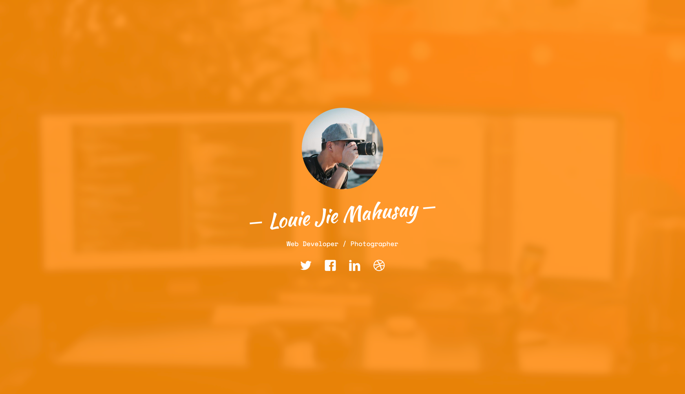

#### My answers
- Does the design capture attention and encourage interaction? (What graphical elements are the most attractive?)

Yes, the orange background attracts attention.

- Are users able to easily find information? (How do you rate the readability of the content?; Is the navigation intuitive?)

Yes, in my opinion, the website is clear, and the information is where I expect it to be.

- Is the design responsive and functioning correctly on various devices? (What are the user experiences on different devices?; Are interactions smooth and seamless on smartphones, tablets, and computers?)

Yes.

- Are there areas that users find difficult or unintuitive?

The links lead nowhere, as this is a template. However, it could provide examples of posts and project descriptions.

- Is the design compliant with the latest trends and industry standards? (Does it meet current UX/UI standards?; Does it incorporate innovative solutions in line with current trends?)

No, but it still looks fresh.

- Are users easily situated within the project context? (What are users' first impressions upon entering the website or opening the portfolio?; Do they immediately understand what you do and what you offer?)

Yes, the first impression was the creativity of the author.

- Are there any elements that deter users or cause confusion? (Are there any elements that may deter users?; Are there elements that are not consistent with the rest of the design?)

No, except for the non-functional map at the bottom of the page.

### Conclusion from all templates

Possibility of changing the color scheme in dark and light modes is something that, in my opinion, improves reading comfort. Additionally, it's worth starting with showing your description on the homepage. Although overall, "Slick Portfolio Svelte by Riadh Adrani" doesn't convince me entirely, I liked the navigation layout.

## Questionnaire result
It's hard to find volunteers who can say what they think about design projects.

In first wave I found only one person. His opinion was added to description of founded items.
In next wave I found second person. His opinion was added to description of founded items.

## What I want

### Logo font research

#### Ninjabot

Link: [Fontriver Ninjabot](https://pl.fontriver.com/font/ninjabot/)

Screenshot with "Ugz" part of logo:
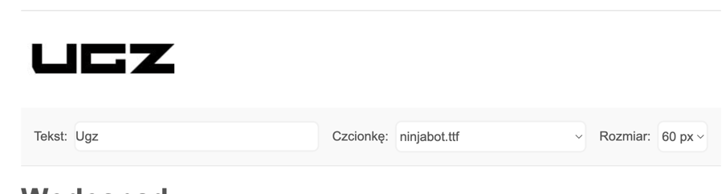

#### Apollo Rocket

Link: [Fontriver Apollo Rocket](https://pl.fontriver.com/font/apollo_rocket/)

Screenshot with "Ugz" part of logo:
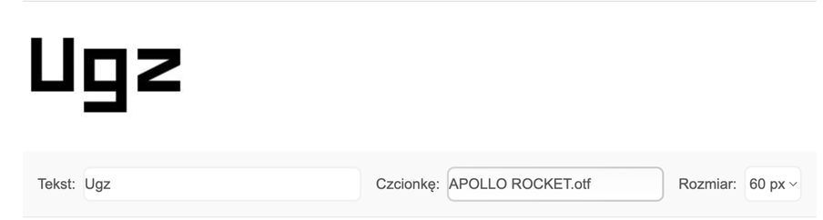

#### Gastino

Link: [Fontriver Gastino](https://pl.fontriver.com/font/gastino/)

Screenshot with "Ugz" part of logo:
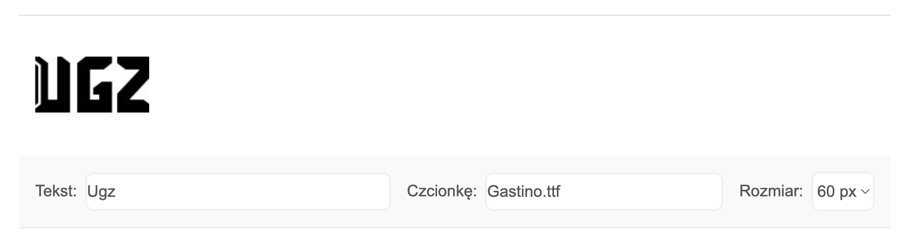