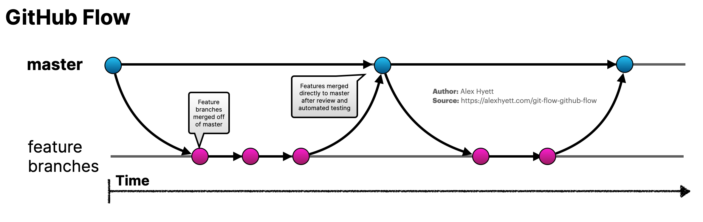

# GitHub Flow
[< Back to Documentation README](README.md)

The GitHub Flow workflow defines a strict branching model designed aroud the project relase.



As you can see, for this flow there is one master branch (in the current project named main), and a dedicated branch will be created for each feature.

# Examples

## Issue Naming
Pull request should be made from assigned issue.

### Common Convention
Naming convention:
```
[Type] Topic of an issue
```

### Type
- spike
- hotfix
- feature

## Creating branch
When starting work on a new feature/hotfix/spike, branch off from the main branch.

```shell
$ git checkout -b issue_number-myfeature
Switched to a new branch "issue_number-myfeature"
```
Example:
```shell
$ git checkout -b 12-support-languages
```

## Incorporating a finished feature
After creating the feature commit the changes to  remote origin and create Pull Request describing the feature.

```shell
$ git add <add files>
$ git commit -m <make appropriate comment>
$ git push origin my-feature-branch
```

The merge should be made with squash and appropriate message describing the feature

## Pull Request and Approval
Common conventions:

Naming convention:
```
[issue number] issue topic
```

### Example
```
[12] Implemented languages support 
```

Describe what issue was about and what changed.

Code can be merged to main only after approvals from Repo Owners.

Merge to master branch can be made only by Repo Owner.
